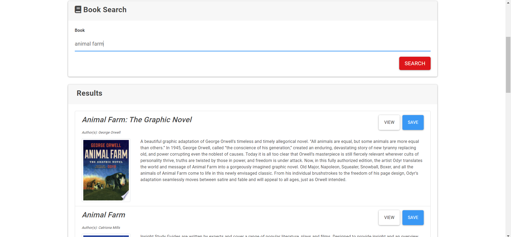
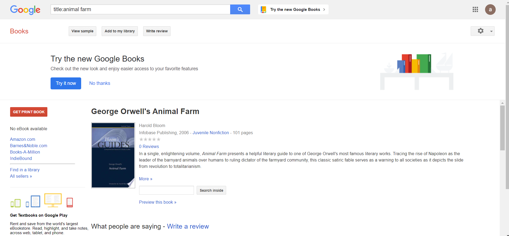
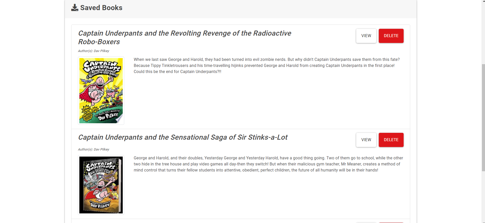
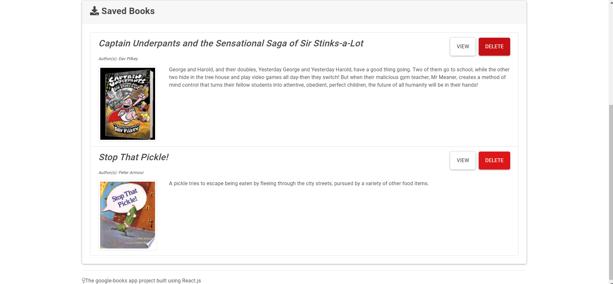

# Google Book Search - Search Books with Google API using React

## Description

A simple search based application to render lists of data obtained from google database on search query given by user. Application that brings back a list of books based on the search query and allows user to view in the google browser and an option to save information on the book of interest in a mongoose database. This saved book can then be viewed later in the _saved_ section of the application.

## Purpose

The ***Google Book Search*** application was a small project to utilize gained knowledge, build experience, and practice web development using React and bootstrap. The set up was given to gain experience using MERN file tree organization. 

## Table of Contents

* [Description](#description)
* [Purpose](#purpose)
* [Technologies](#technologies)
* [Usage](#usage)
* [Credits](#credits)
* [License](#license)

## Technologies:

The technologies used to create this terminal application are as follows:
- JavaScript
- React.js
- Express
- React-router-dom
- Node.js
- Node Package Manager
- GitHub
- GitBash terminal
- Google
- React-semantic-ui 

## Usage

It has three simple feature to make searching through a large collection of book titles based on a simple search query. The application renders books with title keyword matches of the query.
To use simply type any title in mind on the **Search Input** and click the ***Search*** button.

---

---
The second feature this application has is to *view* the book using google's browser. By clicking the ***View*** button, the application will open up a new tab with the book's title as the search query

Book Search using the View button
---

---

---
The third functionality is the Save/Delete feature of the application. Once you found what you were looking for but decided that it is not the time to view the book yet, simply just click the ***Save*** button and the application will save the information in a mongo database and render it in the **Saved** section of the application. 

---

Once you are ready to remove this book from the database, then simply click the ***Delete*** button on the application and the book's information will be removed from the database and re-render the new list of books for you to view.

[Adrian'sGithub](https://github.com/adrianromero13)

## Credits

* UC Berkeley, Extensions Full Stack Development BootCamp Instructors & Assistants
    - Manny Jucaban
    - Musa Akbari
    - Amanda Crawford

* Google inc.           **[Google](https://www.google.com)**
* NPM Registry          **[NMP](https://docs.npmjs.com/)**
* GitHub                **[GitHub](https://github.com/)**
* React documentation   **[React](https://react.semantic-ui.com/)**
    
    

## License

[GNU General Public License v3.0](./LICENSE.txt)

## Contributing

[Contributor Covenant](https://www.contributor-covenant.org/)

---
Adrian Romero 2020 React App Project Google Book Search Application
